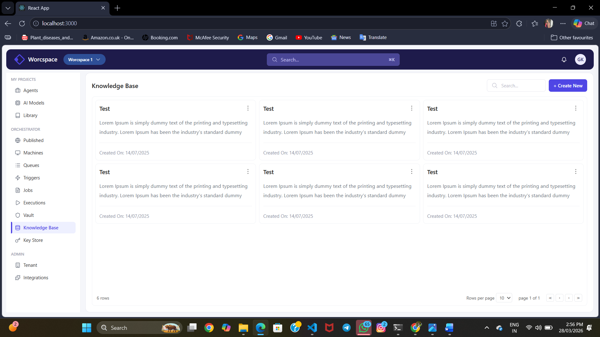
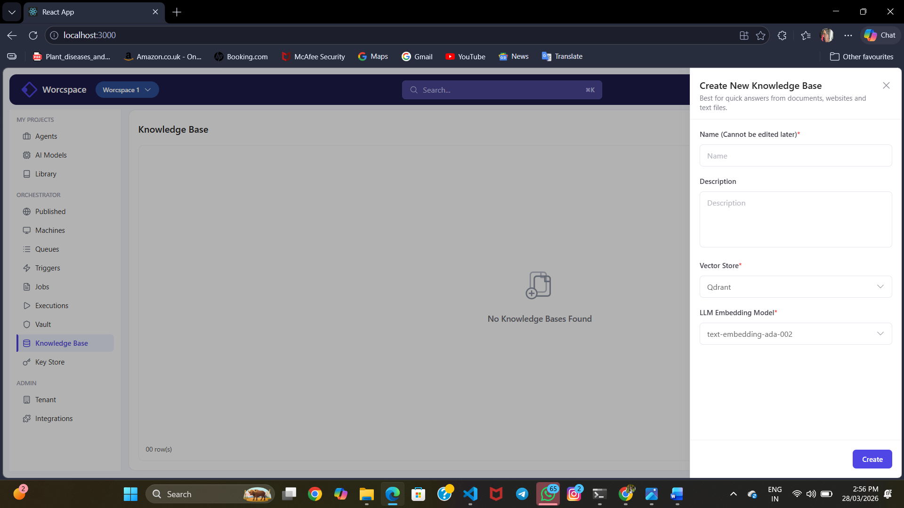

# Knowledge Base UI

This project is a React-based front-end application built based on the provided design.

## 📌 Overview

The application represents a Knowledge Base dashboard UI with sidebar navigation, a top navbar, and a content area displaying cards. It also includes a drawer (modal) that opens when clicking the "Create New" button.

## 🚀 Features

- Pixel-accurate UI based on design
- Reusable React components
- Sidebar navigation layout
- Top navbar with search and profile
- Cards display for knowledge base items
- Empty state UI when no data is available
- "Create New" drawer interaction
- Clean and structured code

## 🛠 Tech Stack

- React (Functional Components + Hooks)
- Tailwind CSS

## 📂 Project Structure

src/
components/
    Navbar.jsx
    Sidebar.jsx
    Card.jsx
    Drawer.jsx
pages/
    Home.jsx


## ▶️ How to Run the Project

1. Install dependencies:
```bash
npm install

2. Start the development server:
npm start

3.Open in browser

http://localhost:3000


##Screenshots

Home Screen


Create New Drawer



⚠️ Notes

.The design was provided as a PDF screenshot, so exact icon assets were not available.
.Icons are approximated to closely match the design.
.Layout, spacing, and styling are implemented to closely resemble the given design.


👩‍💻 Author

Noora Beegam